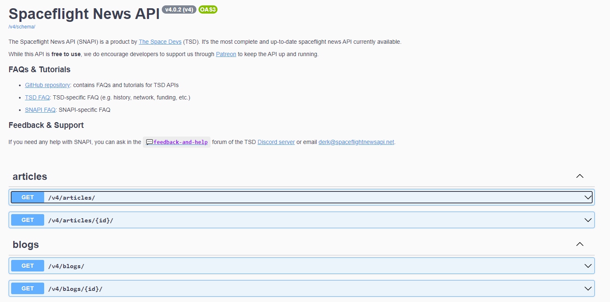

Napisz aplikacje, która pobiera z wybranego API newsy, a następnie zapisuje je do bazy danych. Utwórz GUI, które umożliwia na przeglądanie newsów i ich edycje.

Z listy dostępnych free api wybrałam Spaceflight News API https://spaceflightnewsapi.net

Nie wymaga on utworzenia konta oraz odpowiedniego klucza, wystarczy odpowiednio zbudowane zapytanie, aby pobrać dane

Więcej można znaleźć w dokumentacji https://api.spaceflightnewsapi.net/v4/docs/#/articles/articles_list

Z pomocą Json2Pojo dodałam klase modelowe na które zostaje mapowane to, co pobieram z API

Tutaj znajduje się link do frontendu: https://github.com/monikaRegula/ksb2jdbcdomowe2